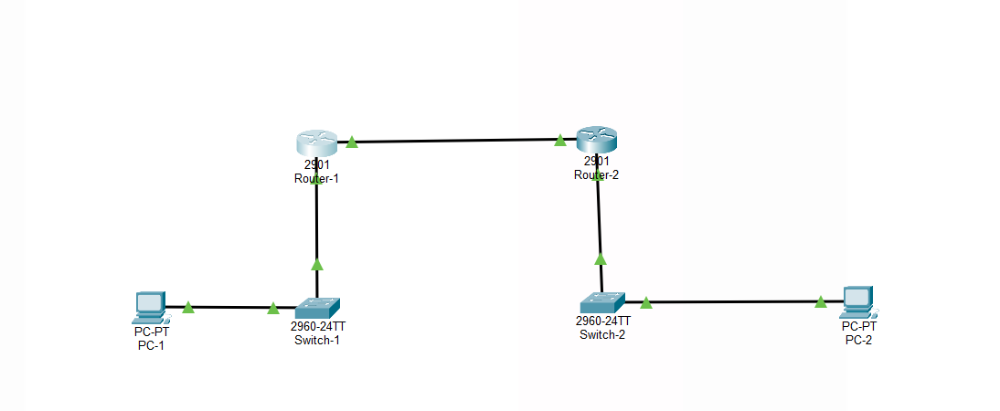

# packet_tracer_static_routing

## Overview
Configuration of static routes between two routers to enable communication between two computers on separate networks.

## Topology
Reference:

Result:

Two routers (Router-1 and Router-2) connected together.
- Router-1: 192.168.10.1/24 (LAN), 192.168.20.1/24 (point-to-point link to Router-2)
- Router-2: 192.168.30.1/24 (LAN), 192.168.20.2/24 (point-to-point link to Router-1)

## Configuration
Added static routes on both routers pointing to networks they couldn't reach otherwise.

Router-1:
ip route 192.168.30.0 255.255.255.0 192.168.20.2

Router-2:
ip route 192.168.10.0 255.255.255.0 192.168.20.1

## Issues / Troubleshooting
Verified routing tables on both routers using 'show ip route' to confirm static routes were present before testing end-to-end connectivity with ping.

## What This Demonstrates
Understanding of static routing logic, subnetting, and basic network configuration.